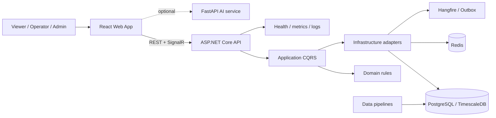
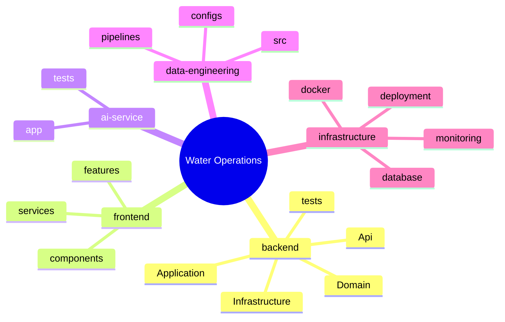
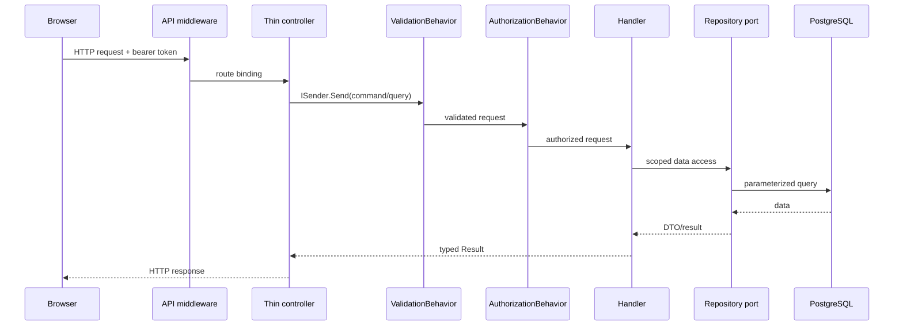
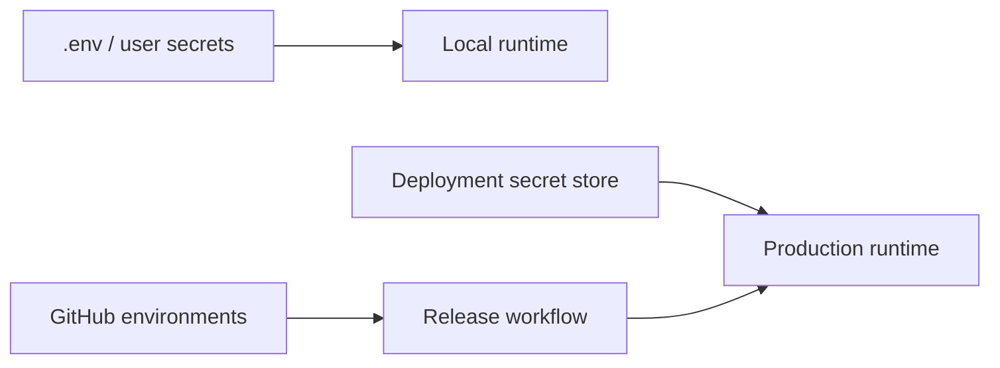
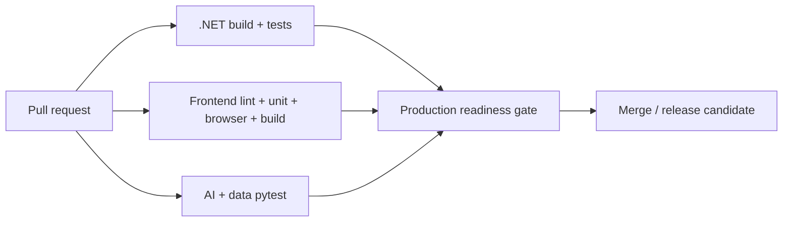

# Water Operations Intelligence Platform

Production-oriented platform for water telemetry, operational intelligence, alerting, and AI-assisted analysis. It combines a .NET API, React operations UI, optional AI service, independent data workflows, and deployment assets.

## Platform architecture





## Technology stack

| Area | Technology | Responsibility |
|---|---|---|
| API | .NET 10, ASP.NET Core, MediatR | HTTP transport and use-case dispatch |
| Architecture | Clean Architecture + vertical slices | Dependency and business boundaries |
| Persistence | EF Core, PostgreSQL/TimescaleDB | Operational and time-series data |
| Cache/jobs | Redis, Hangfire, outbox | Cache, recurring work, reliable delivery |
| UI | React 19, TypeScript, Vite, TanStack Query | Operations and viewer experience |
| AI | Python 3.12, FastAPI | Optional intelligence capabilities |
| Delivery | Docker Compose, GitHub Actions | Local runtime and governed promotion |

## Request lifecycle



## Local quick start

Prerequisites: Docker Desktop with Compose v2, .NET 10 SDK, Node.js 20+ (Node 22 in CI), and Python 3.12 for AI/data services outside Docker.

```powershell
Copy-Item .env.example .env
.\scripts\dev.ps1
dotnet run --project backend/src/WaterOperations.Api --launch-profile http
npm --prefix frontend ci
npm --prefix frontend run dev
```

Use `./scripts/dev.sh` on macOS/Linux. Add `-WithAi` to start the optional AI container.

| Service | URL |
|---|---|
| Frontend | http://localhost:5173 |
| API | http://localhost:5102 |
| Liveness | http://localhost:5102/health/live |
| Readiness | http://localhost:5102/health/ready |
| Swagger/OpenAPI | http://localhost:5102/swagger |
| Scalar | http://localhost:5102/scalar |
| AI health | http://localhost:8000/health |

## Configuration and security

Inject `ConnectionStrings__Default`, `ConnectionStrings__Redis`, `Authentication__SigningKey`, `Cors__AllowedOrigins__0`, `VITE_API_BASE_URL`, and `AI_SERVICE_URL` through local environment files or deployment secret stores. Never commit credentials; frontend variables are public after bundling.



## Quality gates



```powershell
dotnet build backend/src/WaterOperations.slnx --configuration Release
dotnet test backend/src/WaterOperations.slnx --configuration Release
./scripts/verify-production-readiness.ps1
npm --prefix frontend run lint
npm --prefix frontend run format:check
npm --prefix frontend run test:unit -- --run
npm --prefix frontend run build
```

## Documentation index

- [Architecture](docs/architecture/README.md)
- [API guide](docs/api/README.md)
- [Development guide](docs/development/README.md)
- [Deployment and promotion](docs/deployment/README.md)
- [Backend](backend/README.md)
- [Frontend](frontend/README.md)
- [AI service](ai-service/README.md)
- [Data engineering](data-engineering/README.md)
- [Database operations](infrastructure/database/README.md)
- [Docker runtime](infrastructure/docker/README.md)
- [Production readiness](docs/production-readiness/release-governance.md)
