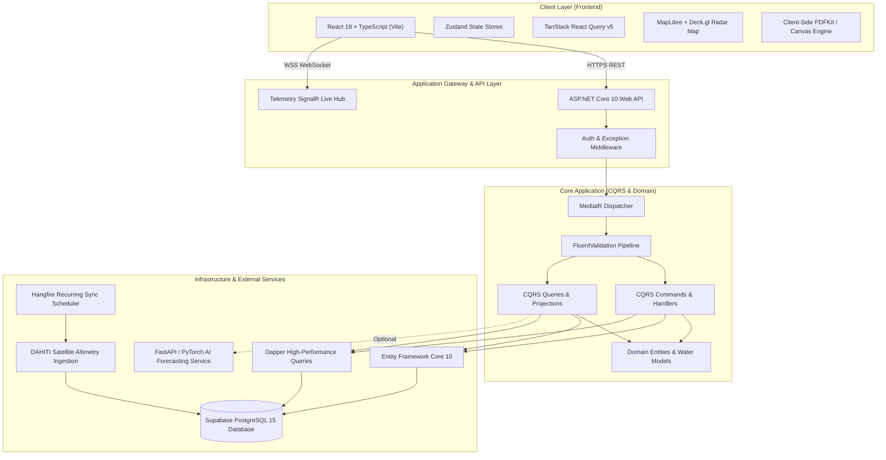

# 🌊 Water Operations Intelligence Platform (WaterOps)

[](https://dotnet.microsoft.com/)
[](https://react.dev/)
[](https://www.typescriptlang.org/)
[](https://www.postgresql.org/)
[](https://dotnet.microsoft.com/apps/aspnet/signalr)
[](LICENSE)

An enterprise-grade, mission-critical **Water Operations Intelligence & SCADA Platform** designed for real-time telemetry ingestion, AI-driven hydrological forecasting, anomaly detection, automated multi-format compliance reporting, and operator console management across national water basin networks.

Developed under strict Clean Architecture specifications with an end-to-end real backend connection (ASP.NET Core 10 Web API + Supabase PostgreSQL) and an executive, responsive white-theme operations dashboard.

---

## 📑 Table of Contents

- [Key Platform Features](#-key-platform-features)
- [Enterprise Architecture Overview](#-enterprise-architecture-overview)
- [System Architecture Diagram](#-system-architecture-diagram)
- [Technology Stack](#-technology-stack)
- [Hydrological Reach & DAHITI Satellite Grid](#-hydrological-reach--dahiti-satellite-grid)
- [Directory & Solution Structure](#-directory--solution-structure)
- [Getting Started & Local Setup](#-getting-started--local-setup)
- [Environment Configuration](#-environment-configuration)
- [Backend REST API & WebSocket Surface](#-backend-rest-api--websocket-surface)
- [Reporting Engine (PDF, Excel, CSV)](#-reporting-engine-pdf-excel-csv)
- [Quality Assurance & Verification](#-quality-assurance--verification)
- [License & Authors](#-license--authors)

---

## 🚀 Key Platform Features

### 1. Real-Time Telemetry & Geospatial Map
- **19-Station DAHITI Hydrological Grid**: Real-time water surface elevation ($m$), flow rate ($m^3/s$), storage capacity ($BCM$), and reservoir level telemetry across Egypt's national Nile reaches.
- **Deck.gl & MapLibre GL Integration**: High-performance WebGL geospatial visualizer with live sensor radar pins, threshold breach pulses, interactive popovers, and satellite base layers.
- **SignalR Real-Time Streaming**: Push-based live telemetry pipeline streaming high-frequency station observations to operators without polling.

### 2. AI Intelligence Hub & Anomaly Diagnostics
- **120-Day LSTM Neural Forecasting**: Multi-step deep learning water level predictions with 95% confidence intervals and historical backtesting.
- **DBSCAN Spatial-Temporal Anomaly Detection**: Automatic cluster identification of sudden sensor dropouts, surge anomalies, and uncalibrated gauge drift.
- **Pump Remaining Useful Life (RUL)**: Acoustic and vibration feature analysis forecasting failure probabilities across primary pumping stations.

### 3. Automated Multi-Format Compliance Reporting
- **Pixel-Perfect PDF Engine**: Client and server-side PDF generator crafting executive, high-resolution operational dossiers complete with Egyptian Ministry metadata, cryptographically verified station summaries, charts, and audit stamps.
- **Structured Excel & CSV Data Streaming**: Instant exports of historical time-series datasets formatted for engineering analysis and external audit workflows.

### 4. Executive Light Enterprise Console (UI / UX)
- **Unified White Enterprise Theme**: Clean, executive design language with curated slate and royal blue accents, responsive card containers, and zero dark-mode artifacts.
- **Responsive Adaptive Navigation**: Auto-collapsing sidebar for tablet and mobile viewport dimensions, paired with a non-intrusive tap-outside handler.
- **Real Backend Sync**: Complete integration for Operator Account management, password governance (ASP.NET Identity PasswordHasher), and system preferences directly persisted to PostgreSQL.

---

## 🏗 Enterprise Architecture Overview

The system strictly adheres to **Clean Architecture** and **CQRS (Command Query Responsibility Segregation)** principles:

```
WaterOperations.slnx
├── WaterOperations.Domain          # Pure domain models, entities, value objects, exceptions
├── WaterOperations.Application     # MediatR commands/queries, DTOs, interfaces, validation behaviors
├── WaterOperations.Infrastructure   # EF Core DbContext, Dapper, PostgreSQL, external services, PDF generators
└── WaterOperations.Api              # Thin controllers, SignalR hubs, middleware, Swagger/Scalar documentation
```

### Request Lifecycle & Pipeline Behaviors
1. **HTTP/WebSocket Ingress**: Validated JWT Bearer token decoded by ASP.NET authentication middleware.
2. **MediatR Dispatcher**: Thin controllers delegate exclusively to `ISender.Send(IRequest<Result<T>>)`.
3. **Pipeline Behaviors**:
   - `ValidationBehavior`: Automatic execution of FluentValidation schemas before handler execution.
   - `LoggingBehavior`: Structured Serilog correlation ID propagation.
   - `PerformanceBehavior`: Latency monitoring and slow-query alerting.
4. **Data Access Port**: Handlers communicate with the database via dedicated repository interfaces (`IViewerQueryRepository`, `IAdministrationRepository`, `IDahitiQueryRepository`).

---

## 📊 System Architecture Diagram



---

## 💻 Technology Stack

| Layer | Technologies | Role & Purpose |
| :--- | :--- | :--- |
| **Backend API** | .NET 10.0, ASP.NET Core | Core enterprise Web API and business logic engine |
| **Architecture** | Clean Architecture, MediatR, CQRS | Strict separation of concerns and maintainability |
| **Persistence** | PostgreSQL 15, EF Core 10, Dapper | Relational storage, time-series telemetry, high-throughput queries |
| **Realtime** | ASP.NET Core SignalR | Bi-directional streaming for live station measurements and alerts |
| **Security** | JWT Bearer, ASP.NET PasswordHasher | Cryptographic identity verification and role-based clearance |
| **Frontend** | React 19, TypeScript 5.7, Vite 6 | High-performance Single Page Application (SPA) |
| **Styling** | Vanilla CSS, Modern Design System | Clean, professional Light Enterprise theme |
| **Data Fetching** | TanStack React Query v5, Axios | Optimistic updates, background re-validation, cache management |
| **Geospatial** | MapLibre GL, Deck.gl | Multi-layer GPU-accelerated hydrological mapping |
| **Document Export** | Custom PDF Canvas Engine, SheetJS | Institutional PDF dossiers, Excel sheets, and CSV dumps |
| **Job Scheduling** | Hangfire, BackgroundService | Automated satellite data synchronization and alarm evaluation |

---

## 🛰 Hydrological Reach & DAHITI Satellite Grid

The platform continuously monitors 19 critical hydrological reaches across the Nile Basin in Egypt:

| Station ID | Official Reach Name | Primary Parameter | Target Baseline |
| :--- | :--- | :--- | :--- |
| `11691` | Aswan High Dam Reservoir (Lake Nasser) | Water Level / Storage | 178.50 m |
| `15059` | Old Aswan Dam Regulating Reach | Discharge / Level | 108.20 m |
| `15289` | Toshka Spillway Inflow Canal | Flood Overflow Level | 175.00 m |
| `15290` | Esna Navigation Barrage Reach | Upstream / Downstream Head | 79.40 m |
| `16384` | Nagaa Hammadi Barrage Hydro | Sluice Flow Rate | 65.80 m |
| `16740` | Assiut Multi-Purpose Barrage | Regulatory Basin Level | 51.20 m |
| `17469` | Deirout Regulators Inflow Point | Irrigation Inflow | 48.10 m |
| `17683` | Beni Suef Middle Reach Monitoring | Surface Elevation | 31.50 m |
| `17684` | Roda Gauge (Historic Cairo Island) | Urban Telemetry Baseline | 16.20 m |
| `17685` | Delta Barrage Bifurcation Point | Nile Splitting Reach | 14.10 m |
| `17687` | Rosetta (Rashid) Coastal Outflow | Estuary Discharge | 2.80 m |
| `17694` | Damietta (Dumyat) Faraskur Reach | Marine Outflow Control | 3.10 m |
| `17695` | Zifta Barrage Regulatory Reach | Delta Branch Head | 8.60 m |
| `17699` | Ibrahimiya Canal Main Regulator | Primary Irrigation Canal | 49.30 m |
| `210` | Bahr Youssef Feeder at Lahun | Fayoum Oasis Delivery | 25.80 m |
| `27216` | Salam Canal Sinai Syphon Crossing | Trans-Sinai Water Transfer | 4.20 m |
| `68` | Lake Manzala Ecological Inflow | Lagoon Coastal Inflow | 1.10 m |
| `8972` | Lake Burullus Wetland Exchange Reach | Northern Coastal Delta | 0.90 m |
| `950` | Lake Mariout Drainage Outflow Station | Alexandria Outflow Sluice | -1.20 m |

---

## 📂 Directory & Solution Structure

```
Water-Operations-Intelligence-Platform/
├── .env                                  # Root environment variables (Database, Auth, Ports)
├── .gitignore                            # Clean repository ignore configuration
├── README.md                             # Comprehensive technical documentation
├── backend/
│   ├── src/
│   │   ├── WaterOperations.Api/          # Controllers, SignalR Hubs, Middleware, Dependency Setup
│   │   ├── WaterOperations.Application/  # MediatR Commands, Queries, Handlers, DTOs, Behaviors
│   │   ├── WaterOperations.Domain/       # Core Domain Entities (User, Station, Alarm, Report)
│   │   └── WaterOperations.Infrastructure/ # EF Core Context, Dapper Repositories, Supabase Client
│   └── tests/
│       ├── WaterOperations.UnitTests/    # Unit test suite for CQRS handlers & services
│       └── WaterOperations.IntegrationTests/ # Integration tests for API endpoints
├── frontend/
│   ├── public/                           # Static assets, institutional badges, hero illustrations
│   ├── src/
│   │   ├── api/                          # Strongly typed Axios service clients (Auth, Telemetry, Reports)
│   │   ├── components/
│   │   │   ├── ai/                       # AI Anomaly & RUL diagnostic cards
│   │   │   ├── alarms/                   # Alarm drawer & critical incident lists
│   │   │   ├── charts/                   # Multi-param dual-Y-axis ECharts / Canvas visualizations
│   │   │   ├── layout/                   # Header, AppLayout, responsive Sidebar, Global Search
│   │   │   ├── map/                      # Deck.gl layer builders & MapLibre container
│   │   │   ├── reports/                  # Report generator modal & preview widgets
│   │   │   └── station/                  # Station telemetry drawers & reading inspection modals
│   │   ├── pages/                        # Overview, Map, AiHub, Alarms, Reports, Account, Settings
│   │   ├── store/                        # Zustand state stores (Auth, UI, Realtime filters)
│   │   └── utils/                        # PDF generator, station location resolver, formatters
│   ├── package.json
│   └── vite.config.ts
├── ai-service/                           # Optional Python FastAPI LSTM & DBSCAN models
└── data-engineering/                     # DAHITI sync scripts & historical altimetry pipelines
```

---

## ⚡ Getting Started & Local Setup

### Prerequisites
- **.NET 10.0 SDK** ([Download](https://dotnet.microsoft.com/download))
- **Node.js 20+** or **Node.js 22 LTS** ([Download](https://nodejs.org/))
- **PostgreSQL 15+** (Local instance or remote Supabase project)

### 1. Clone the Repository
```bash
git clone -b feature/water-operations-intelligence-suite-complete https://github.com/nwr4519678/Water-Operations-Intelligence-Platform.git
cd Water-Operations-Intelligence-Platform
```

### 2. Configure Environment Variables
Copy or adjust `.env` in the root directory:
```bash
cp .env.example .env
```

### 3. Backend Setup (.NET 10 Web API)
```bash
# Navigate to API project
cd backend/src/WaterOperations.Api

# Restore and run the API
dotnet restore
dotnet run --launch-profile http
```
The API will launch at `http://localhost:5102` (Swagger available at `http://localhost:5102/swagger`).

### 4. Frontend Setup (React 19 + Vite)
```bash
# Navigate to frontend in a new terminal
cd frontend

# Install dependencies
npm install

# Start Vite development server
npm run dev
```
The operations dashboard will be accessible at `http://localhost:8443` (or `http://localhost:5173`).

---

## ⚙ Environment Configuration

Key configuration parameters across backend and frontend:

### Backend (`appsettings.json` / Environment Variables)
```json
{
  "ConnectionStrings": {
    "Default": "Host=aws-0-eu-central-1.pooler.supabase.com;Port=5432;Database=postgres;Username=postgres.xxx;Password=xxx;SSL Mode=Require;Trust Server Certificate=true"
  },
  "Authentication": {
    "Issuer": "WaterOperations.Authority",
    "Audience": "WaterOperations.Viewer",
    "SigningKey": "WaterOperationsPlatform_SecretKey_2026_Executive_Min_32_Chars!"
  },
  "Cors": {
    "AllowedOrigins": ["http://localhost:8443", "http://localhost:5173"]
  }
}
```

### Frontend (`.env`)
```env
VITE_API_BASE_URL=http://localhost:5102/api/v1
VITE_SIGNALR_HUB_URL=http://localhost:5102/hubs/telemetry
```

---

## 📡 Backend REST API & WebSocket Surface

### Core Endpoints

| Category | HTTP Method | Endpoint | Description |
| :--- | :---: | :--- | :--- |
| **Authentication** | `POST` | `/api/v1/auth/login` | Authenticate operator and generate JWT Bearer token |
| | `GET` | `/api/v1/auth/me` | Fetch active session claims and role privileges |
| **Telemetry & Grid**| `GET` | `/api/v1/viewer/overview` | Fetch live summary across all 19 stations |
| | `GET` | `/api/v1/viewer/stations` | Query stations with coordinate boundaries and thresholds |
| | `GET` | `/api/v1/viewer/stations/{id}` | Detailed historical time-series and sensor telemetry |
| **Alarms & Breaches**| `GET` | `/api/v1/alarms` | Paginated list of active, acknowledged, and resolved alarms |
| | `POST` | `/api/v1/alarms/{id}/acknowledge` | Acknowledge alarm incident with operator audit note |
| **Compliance Reports**| `GET` | `/api/v1/reports` | List generated compliance dossiers and downloads |
| | `POST` | `/api/v1/reports/generate` | Request instant compilation of PDF / Excel / CSV report |
| **User & Settings** | `GET` | `/api/v1/settings/profile` | Retrieve operator identity and assigned sector |
| | `PUT` | `/api/v1/settings/profile` | Update operator display name and configuration |
| | `POST` | `/api/v1/settings/change-password`| Change institutional password verified via PasswordHasher |
| | `GET` | `/api/v1/settings/me` | Get user operational preferences (Timezone, Locale) |
| | `PUT` | `/api/v1/settings/me` | Save operational preferences directly to PostgreSQL |
| **Realtime Hub** | `WSS` | `/hubs/telemetry` | SignalR bi-directional real-time telemetry stream |

---

## 📑 Reporting Engine (PDF, Excel, CSV)

The platform features an institutional-grade document compilation engine:
- **Official Egyptian Government Header**: Incorporates Arab Republic of Egypt and MWRI credentials.
- **Cryptographic Audit Hash**: Each document receives a unique SHA-256 integrity digest.
- **Summary Metrics**: High-level telemetry aggregation (total reaches, active alarms, average flow rate).
- **Tabular Data Presentation**: Complete readings table with status badges (Normal, Warning, Critical).
- **Client-Side Fallback Engine**: If the backend is running disconnected, the dashboard features an in-browser PDF Canvas generator (`frontend/src/utils/pdfGenerator.ts`) ensuring operators can always export emergency compliance reports offline.

---

## 🧪 Quality Assurance & Verification

To execute automated unit and integration tests across the platform:

### Backend Tests (.NET 10)
```bash
# Run unit test suite
dotnet test backend/tests/WaterOperations.UnitTests

# Run integration tests (with test database)
dotnet test backend/tests/WaterOperations.IntegrationTests
```

### Frontend Verification
```bash
cd frontend

# Verify TypeScript compilation and production build
npm run build

# Run linting checks
npm run lint
```

---

## 📜 License & Authors

This project is licensed under the **MIT License** - see the [LICENSE](LICENSE) file for details.

### Developed for
**Ministry of Water Resources & Irrigation (MWRI) - Arab Republic of Egypt**  
*National Water Operations & Telemetry Intelligence Directorate*
