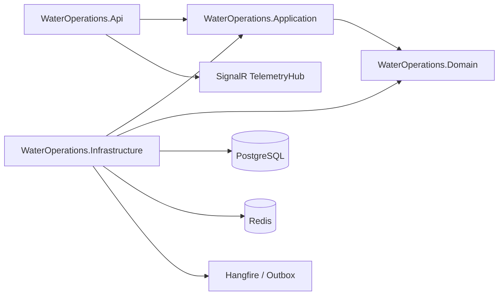
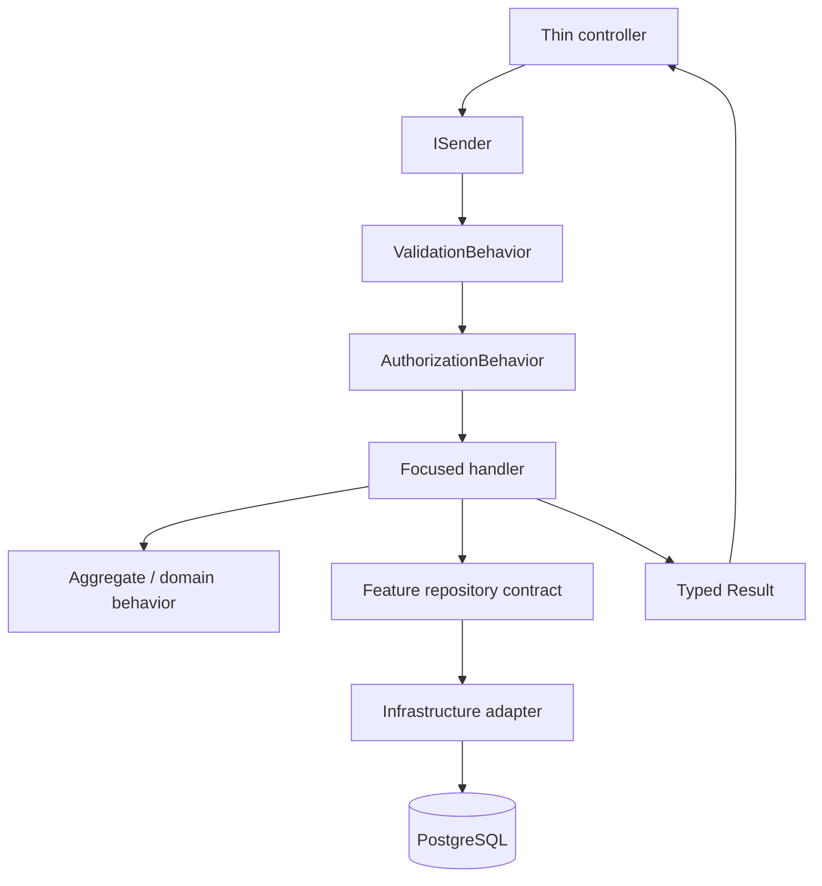

# Backend

The backend is a .NET 10 modular monolith that owns HTTP transport, use cases, domain rules, persistence adapters, background jobs, security, and real-time telemetry delivery.

## Architecture



Dependency direction: `Application -> Domain`, `Infrastructure -> Application + Domain`, and `API -> Application` (with Infrastructure referenced only for composition). Domain and Application never depend on API or Infrastructure.

## Source layout

```text
backend/
├── src/ WaterOperations.Api, Application, Domain, Infrastructure
└── tests/ UnitTests, IntegrationTests, ArchitectureTests
```

## Vertical feature convention

```text
Application/Features/<Feature>/
├── Commands/<UseCase>/   request, handler, validator
├── Queries/<UseCase>/    request, handler, validator
├── DTOs/                 application-owned contracts
├── Interfaces/           feature-specific repository ports
└── Mapping/              feature mapping profiles
```



Controllers do not calculate pagination, query databases, map persistence entities, define DTOs, or implement business rules.

## Local workflow

Run `dotnet restore backend/src/WaterOperations.slnx`, then `dotnet build backend/src/WaterOperations.slnx --configuration Release` and `dotnet test backend/src/WaterOperations.slnx --configuration Release`. For local persistence, start PostgreSQL and Redis, set `ConnectionStrings__Default` and `ConnectionStrings__Redis`, apply EF migrations, then run the API.

### Supabase PostgreSQL

Keep the Supabase connection string server-side and provide it through the .NET environment configuration. Do not commit it to `appsettings*.json`, `.env`, logs, or frontend variables:

```powershell
$env:ConnectionStrings__Default = "Host=<pooler-host>;Port=5432;Database=postgres;Username=<pooler-user>;Password=<url-decoded-password>;Ssl Mode=Require;Trust Server Certificate=true;"
$env:ConnectionStrings__Redis = ""
$env:Seed__Enabled = "false"
dotnet run --project backend/src/WaterOperations.Api/WaterOperations.Api.csproj --urls http://localhost:5102
```

The API applies pending EF Core migrations during startup. Verify the connection with `GET /health/ready`; a successful response is `200 Healthy`. The endpoint checks the EF Core database context, while `/health/live` only checks that the process is running. If the password was exposed outside a secret manager, rotate it in Supabase before production use.

### DaHITI water-level synchronization

The backend can discover DaHITI targets by country and periodically download their water-level time series into `public.dahiti_stations`, `public.dahiti_water_levels`, and `public.dahiti_sync_runs`. Keep the API key server-side and enable the worker only through environment variables:

```powershell
$env:DAHITI_ENABLED = "true"
$env:DAHITI_API_KEY = "<DAHITI_API_KEY>"
$env:DAHITI_COUNTRY = "eg"
# Optional: comma-separated IDs; when empty, the backend calls list-targets for Egypt.
$env:DAHITI_STATION_IDS = ""
$env:DAHITI_SYNC_INTERVAL_MINUTES = "360"
docker compose -p water-operations-intelligence-platform -f infrastructure/docker/docker-compose.yml up -d --build api
```

The first sync starts after the API has applied migrations. Repeated downloads are idempotent by `(dahiti_id, observed_at)`. Check `docker compose ... logs -f api` for the station/reading totals and query `public.dahiti_sync_runs` to audit successful or failed runs. The API key must never be placed in source control, frontend environment variables, or committed `.env` files.

## Verification matrix

| Change | Evidence |
|---|---|
| Domain rule | Unit test and invariant review |
| Query/command | Unit test plus contract/integration coverage |
| Repository | PostgreSQL integration test |
| HTTP contract | Swagger contract test |
| Authorization | Positive and negative scope tests |
| Migration | Backup, migration, readiness, and rollback procedure |

See [architecture](../docs/architecture/README.md), [API](../docs/api/README.md), and [production readiness](../docs/production-readiness/testing-strategy.md).
