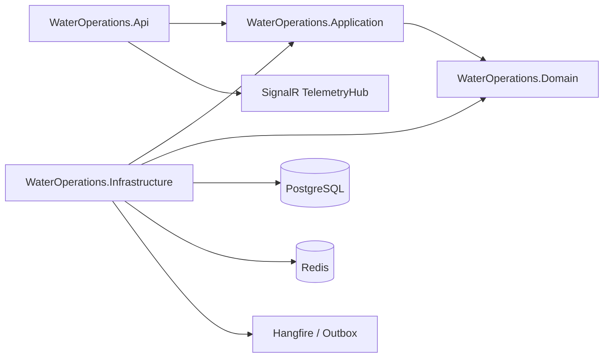
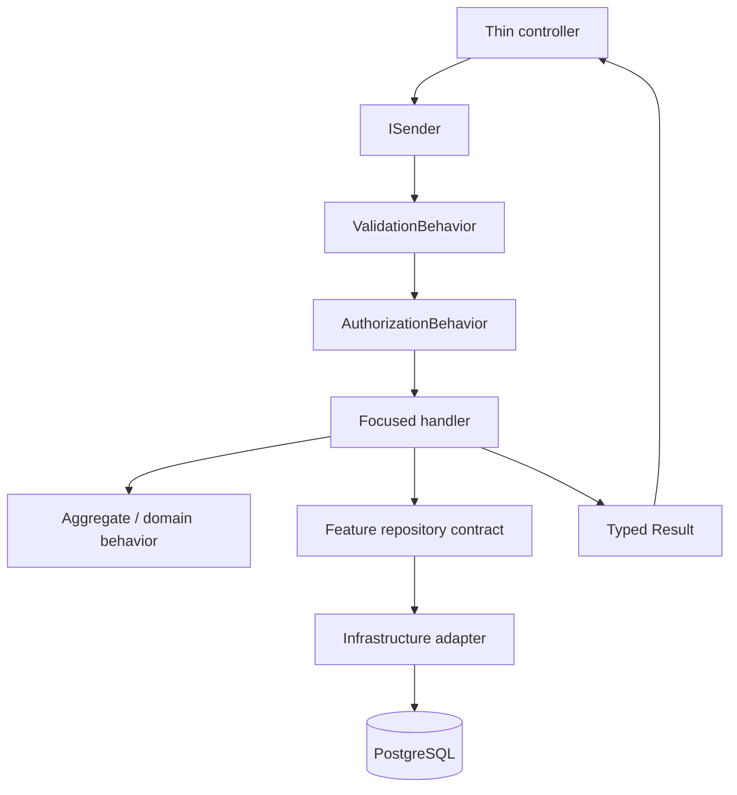

# Backend

The backend is a .NET 10 modular monolith that owns HTTP transport, use cases, domain rules, persistence adapters, background jobs, security, and real-time telemetry delivery.

## Architecture



Dependency direction: `Application -> Domain`, `Infrastructure -> Application + Domain`, and `API -> Application` (with Infrastructure referenced only for composition). Domain and Application never depend on API or Infrastructure.

## Source layout

```text
backend/
├── src/ WaterOperations.Api, Application, Domain, Infrastructure
└── tests/ UnitTests, IntegrationTests, ArchitectureTests
```

## Vertical feature convention

```text
Application/Features/<Feature>/
├── Commands/<UseCase>/   request, handler, validator
├── Queries/<UseCase>/    request, handler, validator
├── DTOs/                 application-owned contracts
├── Interfaces/           feature-specific repository ports
└── Mapping/              feature mapping profiles
```



Controllers do not calculate pagination, query databases, map persistence entities, define DTOs, or implement business rules.

## Local workflow

Run `dotnet restore backend/src/WaterOperations.slnx`, then `dotnet build backend/src/WaterOperations.slnx --configuration Release` and `dotnet test backend/src/WaterOperations.slnx --configuration Release`. For local persistence, start PostgreSQL and Redis, set `ConnectionStrings__Default` and `ConnectionStrings__Redis`, apply EF migrations, then run the API.

## Verification matrix

| Change | Evidence |
|---|---|
| Domain rule | Unit test and invariant review |
| Query/command | Unit test plus contract/integration coverage |
| Repository | PostgreSQL integration test |
| HTTP contract | Swagger contract test |
| Authorization | Positive and negative scope tests |
| Migration | Backup, migration, readiness, and rollback procedure |

See [architecture](../docs/architecture/README.md), [API](../docs/api/README.md), and [production readiness](../docs/production-readiness/testing-strategy.md).
