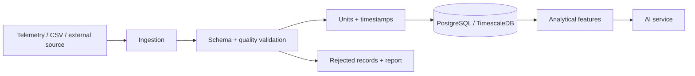
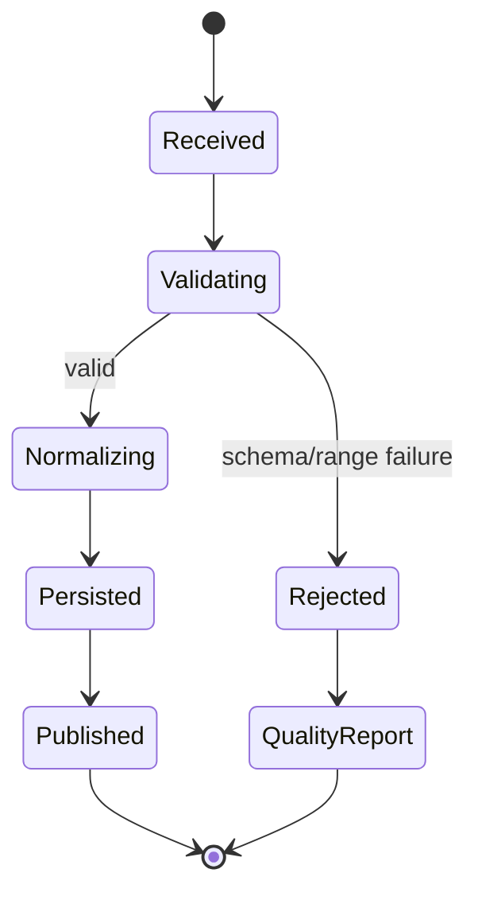

# Data engineering

Independent Python workflows for ingestion, validation, normalization, quality checks, and analytical preparation. This package is decoupled from the .NET API and communicates through explicit storage and data contracts.

## Layout

`src/water_operations_data` contains reusable Python code; `pipelines` contains executable workflows; `configs` contains non-secret configuration; `tests` contains unit and data-quality tests; `Output_Data` is generated local output.

Install test dependencies with `python -m pip install -e ".[test]"` and run `pytest`. Secrets belong in environment variables or the deployment secret store. Pipelines must be deterministic, explicit about units/timezones, and idempotent where possible.
