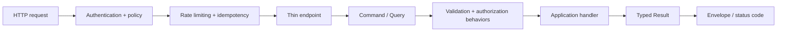

# API guide

The API is versioned under `/api/v1`. Controllers bind HTTP input, dispatch through `ISender`, and translate typed application results into HTTP responses.

Use Swagger for the current contract. Collection endpoints use the shared pagination request when pagination is appropriate; pagination, filtering, sorting, and database access belong in the Application handler/repository, never in controllers. Authentication uses bearer tokens and scoped organization/region authorization. Error responses include a stable error code and trace correlation.
