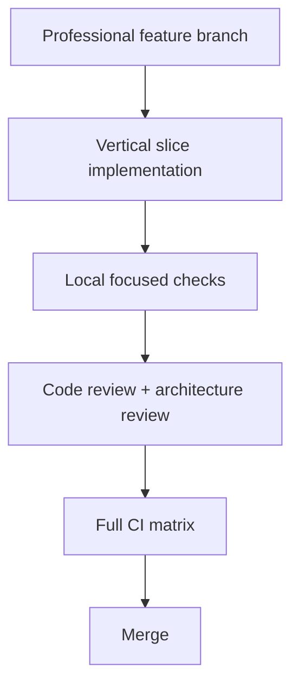

# Development guide

Start dependencies with `scripts/dev.ps1`, work in the relevant bounded component, and run the narrowest checks while editing. Before opening a pull request, run the complete backend/frontend/Python gates described in the root README.

Backend handlers use CQRS and application ports; controllers are thin. Frontend features own UI behavior; shared components remain generic. Never commit secrets, generated output, local paths, or unrelated formatting changes.
