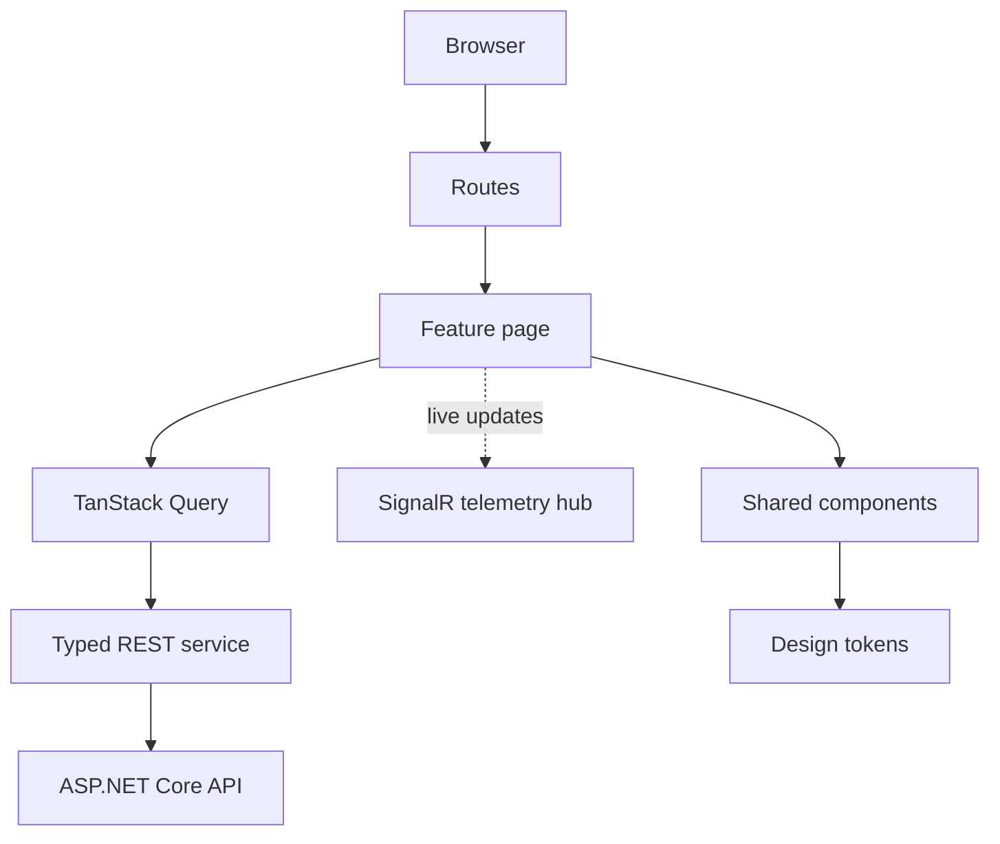
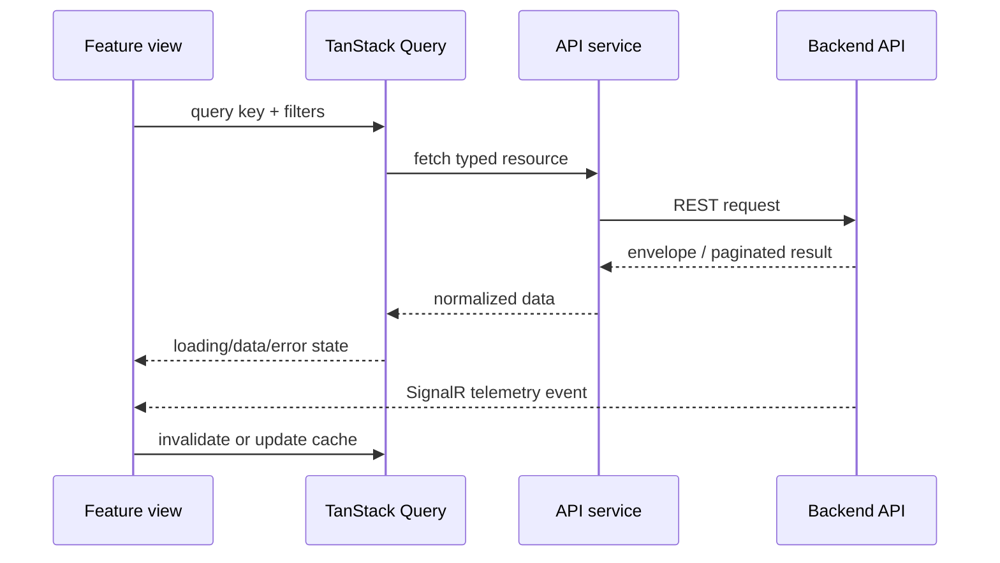

# Frontend

React 19 + TypeScript operations shell built with Vite. The UI consumes versioned API contracts and SignalR telemetry; it does not own backend business rules.

## Structure

`src/app` contains bootstrap/providers; `routes` owns route configuration; `features` contains viewer/operator/admin slices; `services` owns HTTP and SignalR clients; `components`, `shared`, `hooks`, `types`, and `tokens` provide reusable UI foundations. Browser tests live in `tests/browser`.

## Data flow

## Configuration

Only `VITE_` variables are exposed to browser code. Use `.env.local`; never put credentials there because values are bundled into public assets. Supported values include `VITE_API_BASE_URL` and `VITE_SIGNALR_URL`.

## Quality gates

Run `npm ci`, `npm run lint`, `npm run format:check`, `npm run test:unit -- --run`, `npm run build`, install Chromium with Playwright, and run `npm run test:browser`. Keep components accessible, feature behavior local to its feature slice, and TypeScript contracts synchronized with Swagger.
