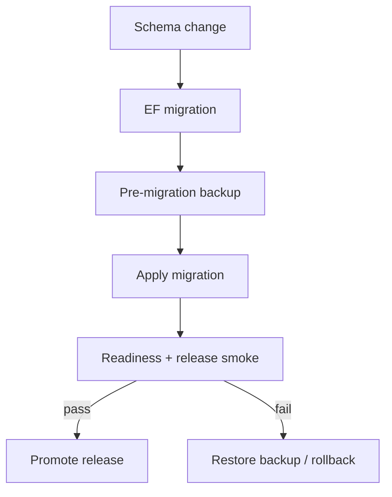

# Database operations

PostgreSQL/TimescaleDB is the system of record for operational and time-series data. EF Core migrations are owned by `WaterOperations.Infrastructure`; backup, restore, and release migration wrappers live beside this README.

Use `release-migration.ps1` for governed releases, `backup.ps1` before destructive maintenance, and `restore.ps1` only with an explicitly supplied restore connection. Never commit database credentials or generated local dumps.
