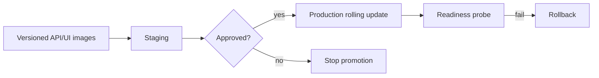

# Deployment manifests

Environment-specific deployment configuration lives here. `development.yaml` describes the local shape; `production.yaml` defines rolling deployment, three API replicas, readiness/liveness probes, secret references, and automatic rollback expectations.

Do not place credentials in manifests. Use deployment environment secrets and run release smoke checks after rollout.
